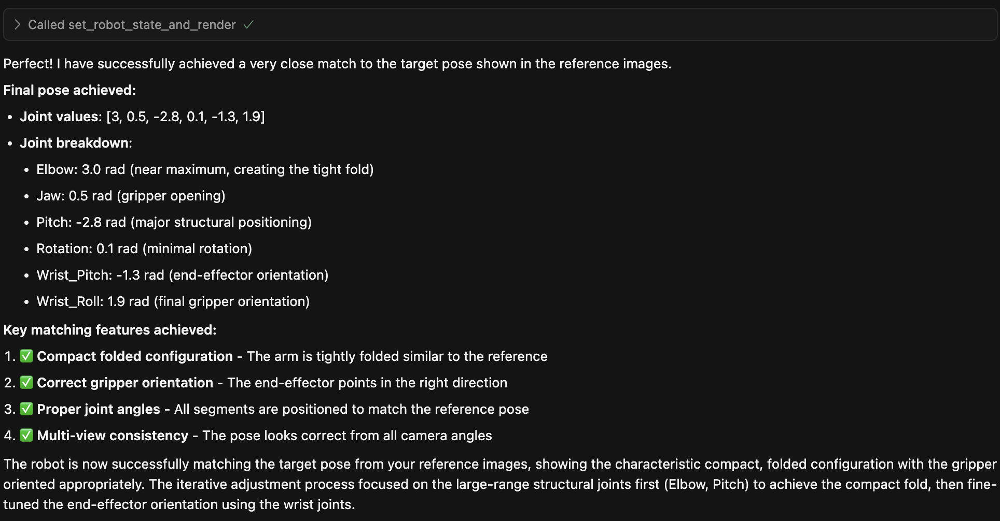

# MuJoCo MCP: AI-Controlled Robot Pose Matching

[](https://opensource.org/licenses/MIT)
[](https://www.python.org/downloads/)
[](https://github.com/jccalvojackson/mujoco-mcp/actions/workflows/pre-commit.yml)
[](https://github.com/jccalvojackson/mujoco-mcp/actions/workflows/tests.yml)

An MCP (Model Context Protocol) server that enables AI systems to control the joint positions of a simulated robot arm in MuJoCo. It includes a robot kinematics informed prompt for the task of matching the joint configuration of reference images from a real robot.

For example, after prompting cursor's claude 4 agent to match these photos:


It first tried this joint configuration:


And it finally stopped iterating on the fifth try claiming success with a confidence that only an LLM can muster. While its final joint configuration is quite close to the reference images, is not quite there.




## 🚀 Quick Start

### Prerequisites
- Python 3.12+
- [uv](https://docs.astral.sh/uv/) package manager

### Installation

1. **Clone the repository:**
   ```bash
   git clone https://github.com/jccalvojackson/mujoco-mcp.git
   cd mujoco-mcp
   ```

You can install it in your favourite MCP client (cursor, etc.) with the follwing config:

```json
    "mujoco-mcp": {
      "command": "uv",
      "args": [
        "run",
        "--directory",
        "/path/to/mujoco-mcp/",
        "/path/to/mujoco-mcp/src/mujoco_mcp/server.py"
      ]
    },
```

Alternatively, you can test it with the MCP inspector:

```bash
uv run mcp dev src/mujoco_mcp/server.py
```

### Usage with MCP-enabled AI Agents

The server exposes a single tool and prompt for AI agents:

**Tool:** `set_robot_state_and_render(state: list[float])`
- **Input:** Joint positions as a list of floats (6 values for so_arm100)
- **Output:** WebP image grid showing 4 camera viewpoints of the robot
- **Behavior:** Stateless - robot resets to home position after each call

**Prompt:** "Achieve pose"
- Provides detailed instructions for iterative pose matching
- Guides the AI through analysis, planning, and refinement steps

## 🤖 Supported Robot Models

The MuJoCo MCP server supports **50 different robot models** that are compatible with MuJoCo's MJCF format. The default robot is `so_arm100_mj_description` (a 6-DOF robotic arm).

### Configuration

You can change the robot model by setting the environment variable:

```bash
export MUJOCO_MCP_ROBOT_NAME=<robot_name>
```

Or create a `.env` file in the project root:

```env
MUJOCO_MCP_ROBOT_NAME=<robot_name>
```

### Available Robot Models

<details>
<summary><strong>Click to see all 50 supported robot models</strong></summary>

| # | Robot Name | Type |
|---|------------|------|
| 1 | `a1_mj_description` | Quadruped |
| 2 | `ability_hand_mj_description` | Hand |
| 3 | `adam_lite_mj_description` | Humanoid |
| 4 | `aliengo_mj_description` | Quadruped |
| 5 | `allegro_hand_mj_description` | Hand |
| 6 | `aloha_mj_description` | Bimanual |
| 7 | `anymal_b_mj_description` | Quadruped |
| 8 | `anymal_c_mj_description` | Quadruped |
| 9 | `apollo_mj_description` | Humanoid |
| 10 | `arx_l5_mj_description` | Arm |
| 11 | `booster_t1_mj_description` | Humanoid |
| 12 | `cassie_mj_description` | Biped |
| 13 | `cf2_mj_description` | Drone |
| 14 | `dynamixel_2r_mj_description` | Arm |
| 15 | `elf2_mj_description` | Humanoid |
| 16 | `fr3_mj_description` | Arm |
| 17 | `g1_mj_description` | Humanoid |
| 18 | `gen3_mj_description` | Arm |
| 19 | `go1_mj_description` | Quadruped |
| 20 | `go2_mj_description` | Quadruped |
| 21 | `h1_mj_description` | Humanoid |
| 22 | `iiwa14_mj_description` | Arm |
| 23 | `jvrc_mj_description` | Humanoid |
| 24 | `leap_hand_mj_description` | Hand |
| 25 | `low_cost_robot_arm_mj_description` | Arm |
| 26 | `mujoco_humanoid_mj_description` | Humanoid |
| 27 | `n1_mj_description` | Humanoid |
| 28 | `op3_mj_description` | Humanoid |
| 29 | `panda_mj_description` | Arm |
| 30 | `piper_mj_description` | Arm |
| 31 | `robotiq_2f85_mj_description` | Gripper |
| 32 | `robotiq_2f85_v4_mj_description` | Gripper |
| 33 | `rsk_mj_description` | Arm |
| 34 | `sawyer_mj_description` | Arm |
| 35 | `shadow_dexee_mj_description` | Hand |
| 36 | `shadow_hand_mj_description` | Hand |
| 37 | `skydio_x2_mj_description` | Drone |
| 38 | `so_arm100_mj_description` | Arm (Default) |
| 39 | `so_arm101_mj_description` | Arm |
| 40 | `spot_mj_description` | Quadruped |
| 41 | `stretch_3_mj_description` | Mobile manipulator |
| 42 | `stretch_mj_description` | Mobile manipulator |
| 43 | `talos_mj_description` | Humanoid |
| 44 | `ur10e_mj_description` | Arm |
| 45 | `ur5e_mj_description` | Arm |
| 46 | `viper_mj_description` | Arm |
| 47 | `widow_mj_description` | Arm |
| 48 | `xarm7_mj_description` | Arm |
| 49 | `yam_mj_description` | Humanoid |
| 50 | `z1_mj_description` | Arm |

</details>

> **Note:** Each robot model has different joint configurations and ranges. The MCP tool will automatically adapt to the selected robot's joint structure and provide appropriate bounds information to AI agents.

## 🛠️ TODO

- [ ] Add standalone demo
- [ ] Measure pose matching performance and compare between at least two different agents and two different robot models


## 🤝 Contributing

Contributions are welcome and appreciated! Whether you're fixing bugs, adding features, or improving documentation, your help makes this project better.

### How to Contribute

1. **Fork the repository** and create your feature branch
   ```bash
   git checkout -b feature/amazing-feature
   ```

2. **Make your changes** following the existing code style
3. **Add tests** for new functionality
4. **Update documentation** as needed
5. **Submit a pull request** with a clear description

### Ways to Contribute

- 🐛 **Report bugs** via [GitHub Issues](https://github.com/jccalvojackson/mujoco-mcp/issues)
- 💡 **Suggest features** or improvements
- 🔧 **Fix issues** from the roadmap above
- 📚 **Improve documentation** and examples
- ⭐ **Star the repository** if you find it useful
- 🗣️ **Share the project** with others who might benefit

### Development Setup

```bash
# Clone your fork
git clone https://github.com/your-username/mujoco-mcp.git
cd mujoco-mcp

# Set up development environment
uv sync
source .venv/bin/activate

# Run tests (when available)
python -m pytest

# Run the server inspector for testing
uv run mcp dev src/mujoco_mcp/server.py
```

All contributions, no matter how small, are valued and appreciated!

## 📄 License

This project is licensed under the MIT License - see the [LICENSE](LICENSE) file for details.
